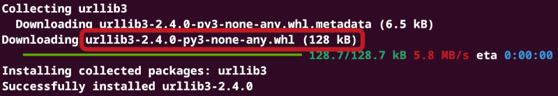

# How pip installs packages

When we install a Python package we might use pip and write something along the lines of

```bash
pip install urllib3
```

But what does that do?

To answer that, we first need to know what a package is.
A package is essentially a collection of Python files together with instructions on how pip should install it.
Now the question is, of course, how pip installs these packages.



The screenshot above shows that pip downloads a `.whl`-file, or a *wheel*-file.
To find that file, it starts by searching [PyPI](https://pypi.org/) for that package, and if it finds it, it checks if it has a wheel file it can download, downloads it and installs it.

So, an obvious question is: what are these *wheel files*? What's in them?

## Exercises

1. Navigate to the [PyPI website](https://pypi.org/) and find the project page for urllib3
2. Download the latest wheel file for urllib3 (the file named `urllib3-{{version}}-py3-none-any.whl`)
3. Rename the downloaded file so it ends with the file extension `.zip` instead of `.whl`
4. Unzip the file and inspect the contents. Discuss what you believe they are with your neighbour
5. Compare the contents of the unzipped wheel file with the [urllib3 source code](https://github.com/urllib3/urllib3). Are there any similarities?


## Reflection

We see that the wheel files contain two things: The importable Python files and package metadata in a [very particular format](https://packaging.python.org/en/latest/specifications/core-metadata/).
So this is what we need to provide to enable other people to install and import our code.
While the source code can be easy to provide in the correct format, the metadata is stored cumbersomely.
For example, the RECORD-file includes SHA-hashes for every single importable file, and we don't want to manually compute those.
Instead, we want to use tools that can make wheels with the accompanying metadata-files automatically from our code.

## Next up
[Creating our first package with uv](./03-our-first-package.md).
